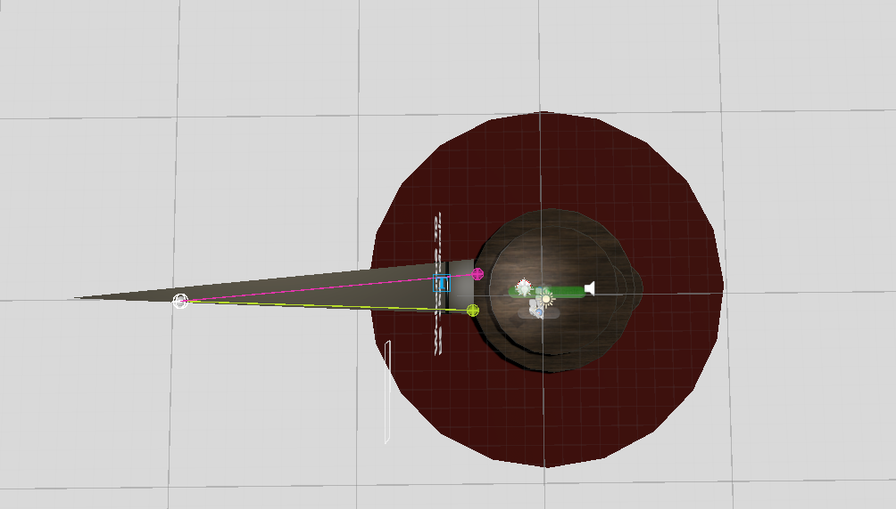
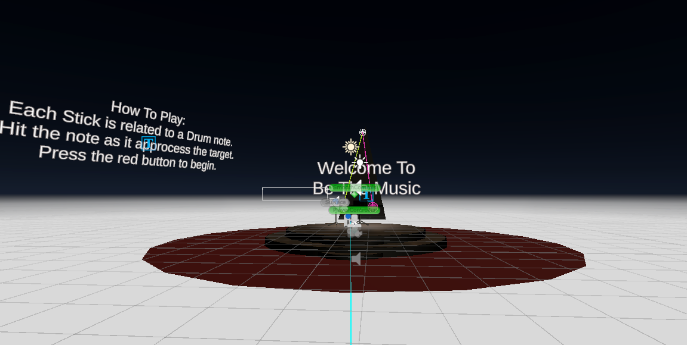
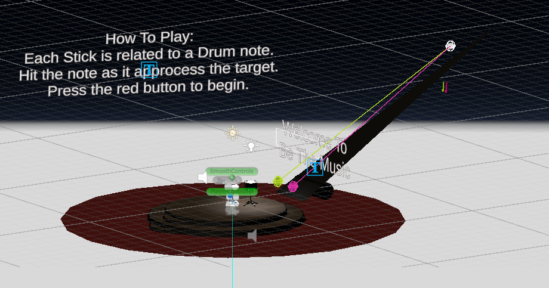
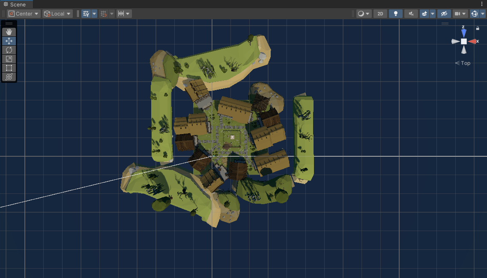
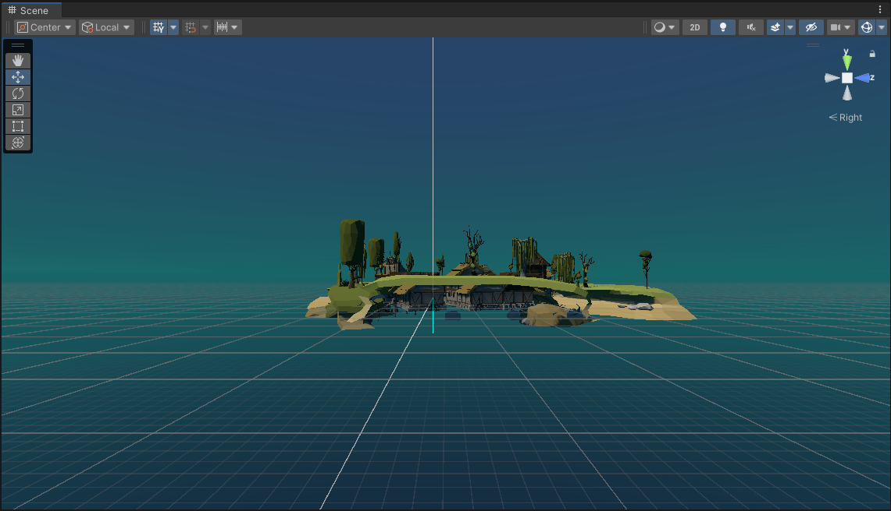
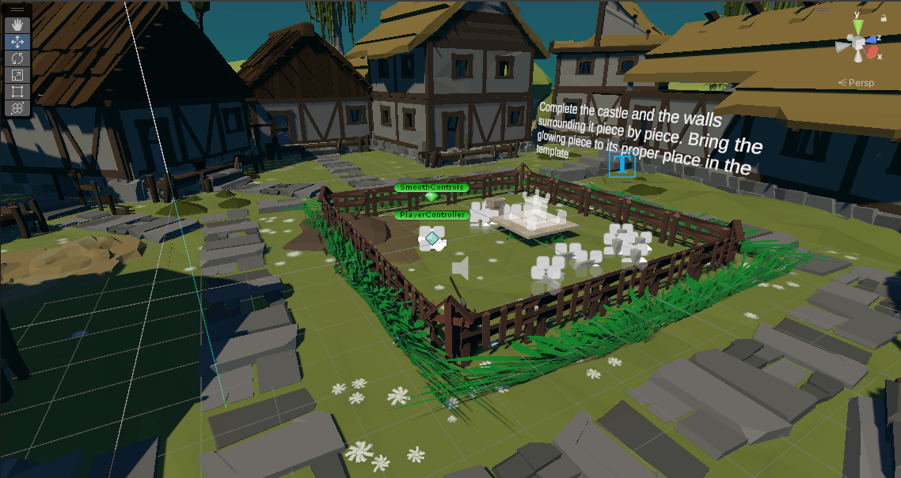
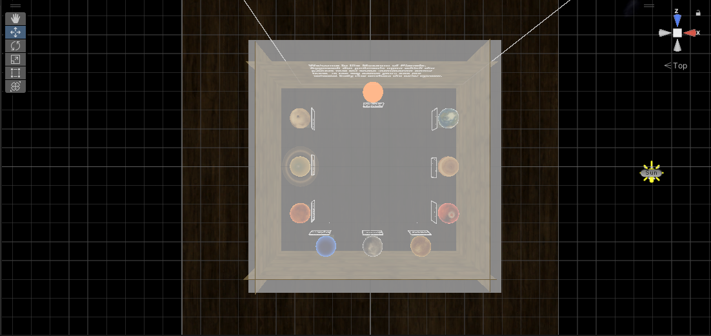
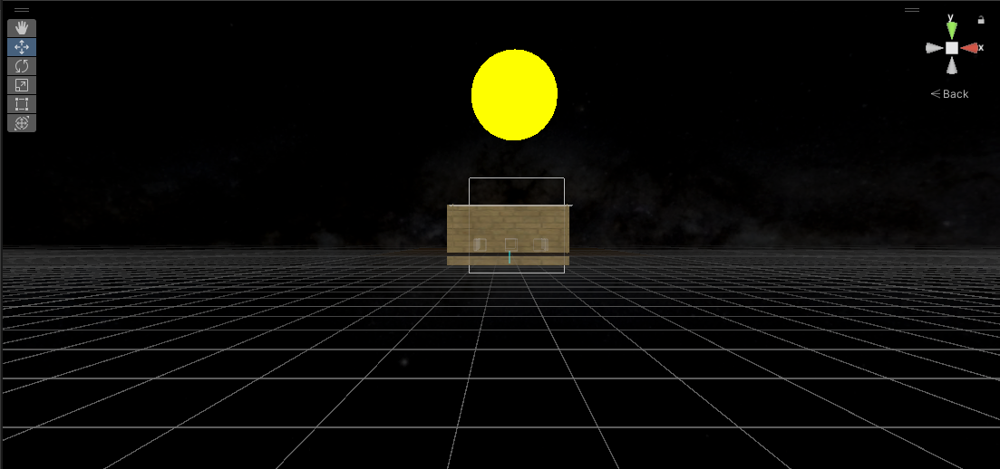
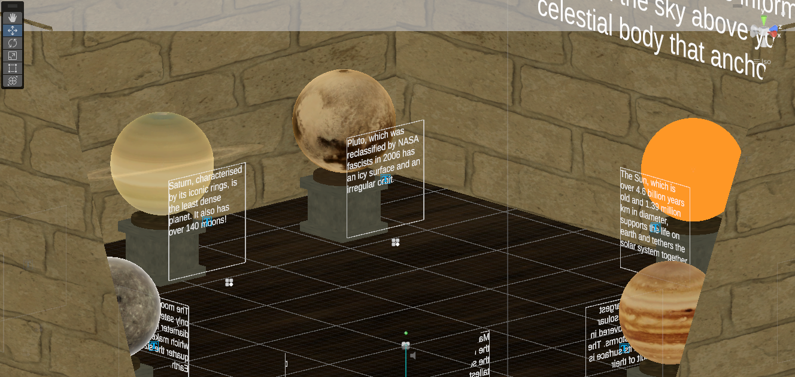

# csc461-projects
UNCW CSC-461 Virtual Reality group projects

### Authors
- Ryan Farrell
- Sinclair DeYoung

---

## Final Project

  
Be The Music (BTM)

  ScreenShots/BeTheMusic.docx

  #### Photos:
  Overhead
  
  Side View
  
  Displayed in 3d
  
  

---

## Project 3  

  
VR Assembly (Puzzle)

  
  User are be able to assemble a virtual object by putting together the individual parts to build a casle. Above in text when entered the game, as shown in the third photo, are the instructions on how to interact.

  Video that shows how the game is played and the environment.
  https://www.youtube.com/watch?v=xKWBF-AjXgw
  
  #### Photos:
  Overhead
  
  Side View
  
  Displayed in 3d
  

---

## Project 2

  
Museum

  In this museum you'll find the 10 prominent celestial bodies that grace our solar system. We chose the solar system due to a mutual fascination with the subject. To get some information about the exhibits, approach the pedestals they rest and some text will appear.
  
  #### BONUSES:
  
  1) There are 10 exhibits, each with a reactive element.
  2) Each exhibit is animated to spin.
  
  
  Video that shows me walking around the scene and activating exhibits.
  https://www.youtube.com/watch?v=hs_eAtpMVx4
  
  #### Photos:
  Overhead
  
  Side View
  
  Displayed in 3d
  

